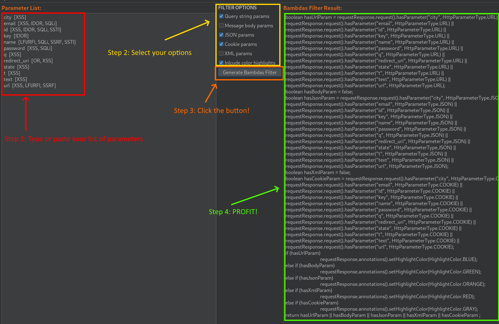

# Dynamic Bambdas Generator

## Description
This is a stand-alone Burp extension designed to create dynamic bambda filters based on user input. This version supports entering request parameter names and will output a filter for URL, BODY, JSON, XML, and COOKIE (depending on the selected options) request parameters within the Proxy history tab. Additionally, if the `Include color highlights` option is selected, the resulting proxy history items will be highlighted according to where the parameter was located.
| Location  | Color  |
|-----------|--------|
| URL/Query | BLUE   |
| Body      | GREEN  |
| JSON      | ORANGE |
| XML       | RED    |
| Cookie    | GRAY   |

## Installation (skip to step 3 if you already have jython installed)
1. Visit Jython Offical Site, and download the latest stand alone JAR file, e.g. jython-standalone-2.7.3.jar.
2. Open Burp, go to Extensions -> Extension Settings -> Python Environment, set the Location of Jython standalone JAR file and Folder for loading modules to the directory where the Jython JAR file was saved.
3. Download the DynaBamGen.py from this project and place in the same directory or a directory of your choosing (just remember the location).
4. Go to the Extensions -> Installed and click Add under Burp Extensions.
5. Select Extension type of Python and select the DynaBamGen.py file. You may need to navigate to your custom folder if a different location was chosen in step 3.

## Usage
1. On the DynaBamGen tab within BurpSuite, enter the parameter names you would like to filter for within the "Parameter List" text area. Note: the current version splits parameters on the space character and truncates any remaining text. Therefore "city [XSS]" below would become "city".
2. Select filter options
3. Click the "Generate Bambdas Filter" button.
4. Copy the generated filter found in the "Bambas Filter Result" text area and paste into your Proxy history.

Step 1 in the image above depicts data copied and pasted from xnl-h4ck3r's GAP-Burp-Extension with Sus params enabled.

## Contributing
See CONTRIBUTING.md

## Authors and acknowledgment
Author: Kelsey Henton, DBG 2024 

Acknowledgements: Your name could be here.  Awaiting your pull request.

## License
This project is published under the MIT license (see LICENSE)
